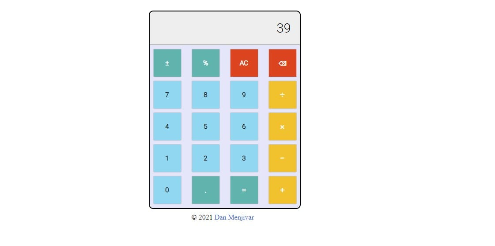

# JS Calculator

### [Live Demo](https://danmenjivar.github.io/js-calculator/)

#### 📝 Description
A calculator built for the web. This is part of the Odin Project curriculum. 

### 💡 Features
* Add
* Subtract
* Multiply
* Divide

#### 🛠️ Built with 
 * HTML
 * CSS
 * JavaScript
 
